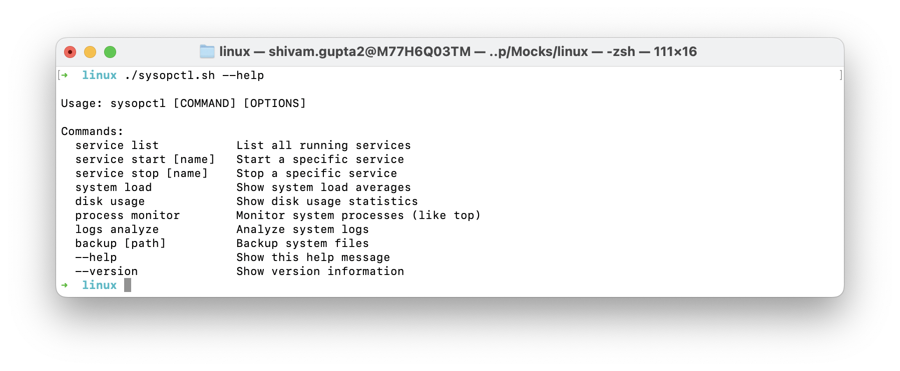
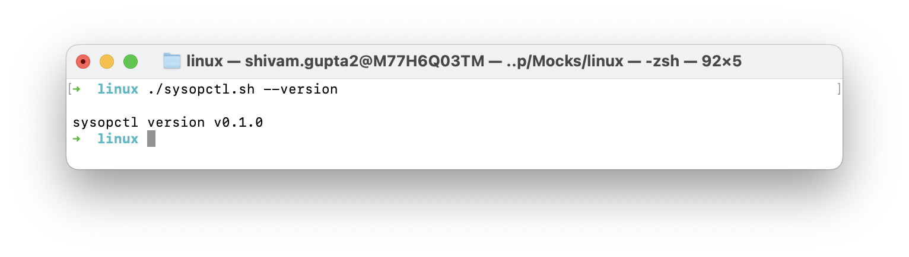
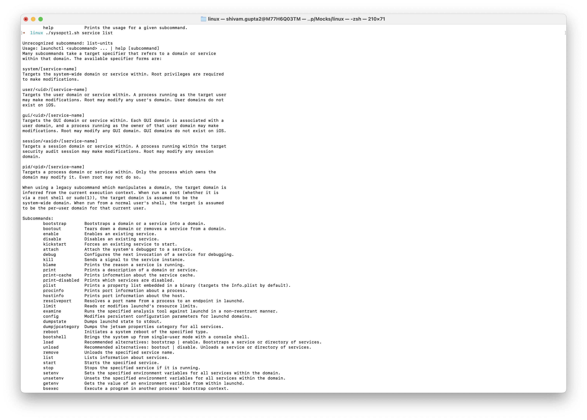
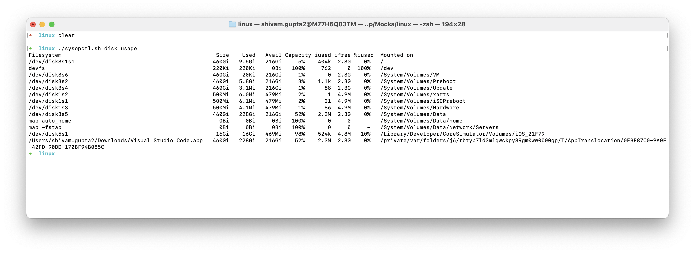
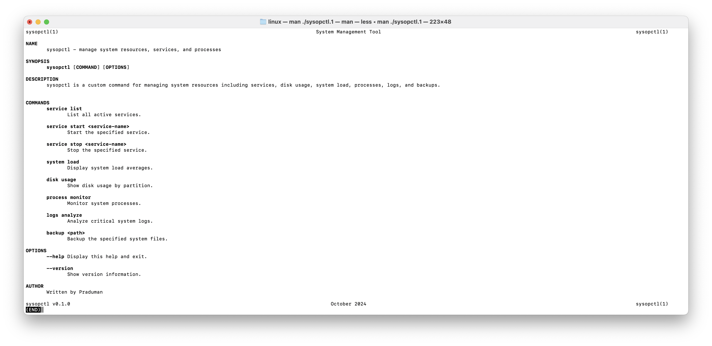

Make the main script executable:

```bash
chmod +x src/sysopctl.sh
```

#### **Step 1: Testing Basic Features**
1. **Help Option**:
   To check if the help command works, run:
   make sure you are already in /src directory

   ```bash
   ./sysopctl.sh --help
   ```

   You should see a list of available commands and their usage.
   


2. **Version Information**:
   Test the version flag:

   ```bash
   ./sysopctl.sh --version
   ```

   Expected output: `sysopctl version v0.1.0`.
   

#### **Step 2: Testing System Operations**

1. **List Running Services**:
   To list active system services (this requires systemd):

   ```bash
   ./sysopctl.sh service list
   ```

   This should display all active services, similar to `systemctl list-units --type=service`.
   

2. **Start a Service**:
   Test starting a service (for example, `nginx`):

   ```bash
   sudo ./sysopctl.sh service start nginx
   ```

   This should start the `nginx` service and confirm the status.

3. **Stop a Service**:
   Test stopping a service:

   ```bash
   sudo ./sysopctl.sh service stop nginx
   ```

   This should stop the `nginx` service.

4. **Check System Load**:
   To view system load averages:

   ```bash
   ./sysopctl.sh system load
   ```

   This will display the system load, similar to the `uptime` command.

5. **Check Disk Usage**:
   To check disk usage:

   ```bash
   ./sysopctl.sh disk usage
   ```

   The output will be similar to `df -h`.
   

6. **Monitor System Processes**:
   To monitor real-time processes (similar to `top`):

   ```bash
   ./sysopctl.sh process monitor
   ```

   This should open the `top` process monitor.

7. **Analyze System Logs**:
   To check system logs for critical errors:

   ```bash
   sudo ./sysopctl.sh logs analyze
   ```

   This will analyze the logs using `journalctl -p 3 -xb`.

8. **Backup System Files**:
   To test the backup command:

   ```bash
   ./sysopctl.sh backup /path/to/directory
   ```

   This will copy the specified directory to `/backup/` using `rsync`.

   Ensure the `/backup/` directory exists, or you can modify the backup location in the script.

#### **Step 3: Manual Page Testing**
You can test the manual page (if installed on your system). To install the man page, run:

```bash
man ./sysopctl.1
```

This should display the `sysopctl` manual page.


